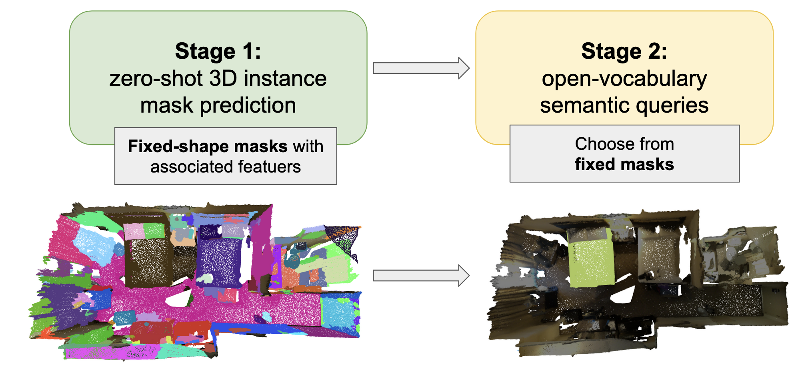
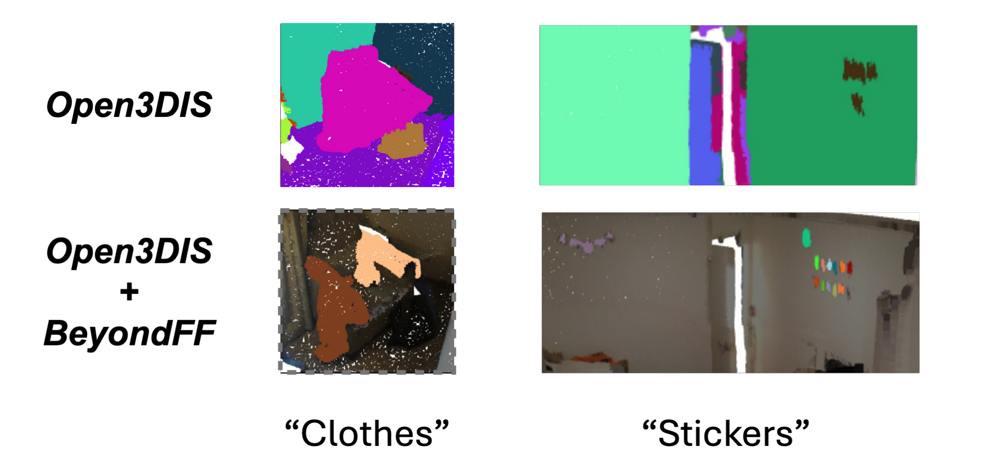
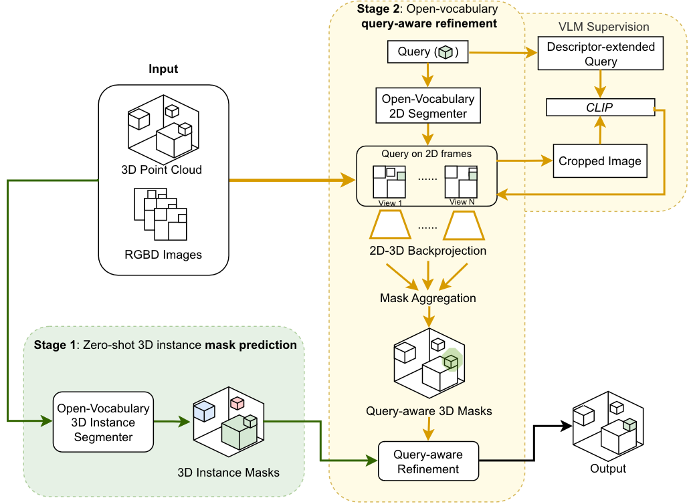

# Beyond-Fixed-Forms
Query-Aware Refinement for Open-Vocabulary 3D Instance Segmentation (OV-3DIS)

Existing OV-3DIS methods follow a 2-stage prediction-and-retrieval scheme:

Beyond-Fixed-Forms (BeyondFF) is a query-aware refinement process that can be applied to any off-the-shelf OV-3DIS method (e.g., Open3DIS) for more comprehensive and well-aligned results:

It leverages the semantic information of text queries to rediscover objects from multi-view RGB-D images and refine fixed-shape 3D instance masks to desired forms in the second stage.


### Installation
```
conda create -n BeyondFF python=3.8
conda activate BeyondFF
pip3 install torch==1.13.1+cu117 torchvision>=0.13.1+cu117 torchaudio>=0.13.1+cu117 --extra-index-url https://download.pytorch.org/whl/cu117 --no-cache-dir 
```

```
pip install -r requirements.txt
```


### Data preparation
Follows [Open3DIS/docs/DATA.md](https://github.com/VinAIResearch/Open3DIS/blob/main/docs/DATA.md)

Then use `./tools/ply2npy.py` transform .ply file under `./data/Scannet200/Scannet200_3D/val/original_ply_files` and store the transformed numpy file under `./data/Scannet200/Scannet200_3D/val/original_npy_files`.

- TODO: Add Replica support

### Stage 1 results
Stage 1 results should be stored under `exp_stage_1`. It should have the form of

```
stage_1_masks = {
            "ins": torch.Tensor,  # (Ins, N) Boolean mask of pointcloud
            "conf": torch.Tensor,  # (Ins, ) Conf scoere
            "final_class": List[str],  # (Ins,) Final class results
        }
```

### Run
Make sure all datapathes in `configs/config.yaml` are correct. Then run the following commands.
```
python tools/segmentation_2d.py --config configs/config.yaml --cls "your query here"
```

```
python tools/projection_2d_to_3d.py --config configs/config.yaml --cls "your query here"
```

```
python tools/refinement.py --config configs/config.yaml --cls "your query here" 
```

### Visualization
```
pip install -r requirements.txt
```

```
python visualization/visualize_scannet200.py  --config configs/config.yaml
```

### Evaluation

#### Automatic processing and evaluation
```
python evaluation/eval/run_evl.py 2>&1 | tee script_log.txt
```

#### Evaluation with processed results 
Manually set pathes in `evaluation/eval/eval_scannet200.py` and run
```
python evaluation/eval/eval_scannet200.py
```
and then check ./results.txt.

### YOLOworld for detection
If you wanna try yoloworld for detection (Not recommanded due to worse performance in our use case)

```
pip install -r requirements_yoloworld.txt
```
Adjust class names in `configs/config.yaml` and run
```
python tools/segmentation_2d_yolo_world.py --config configs/config.yaml --cls "your query here"
```
